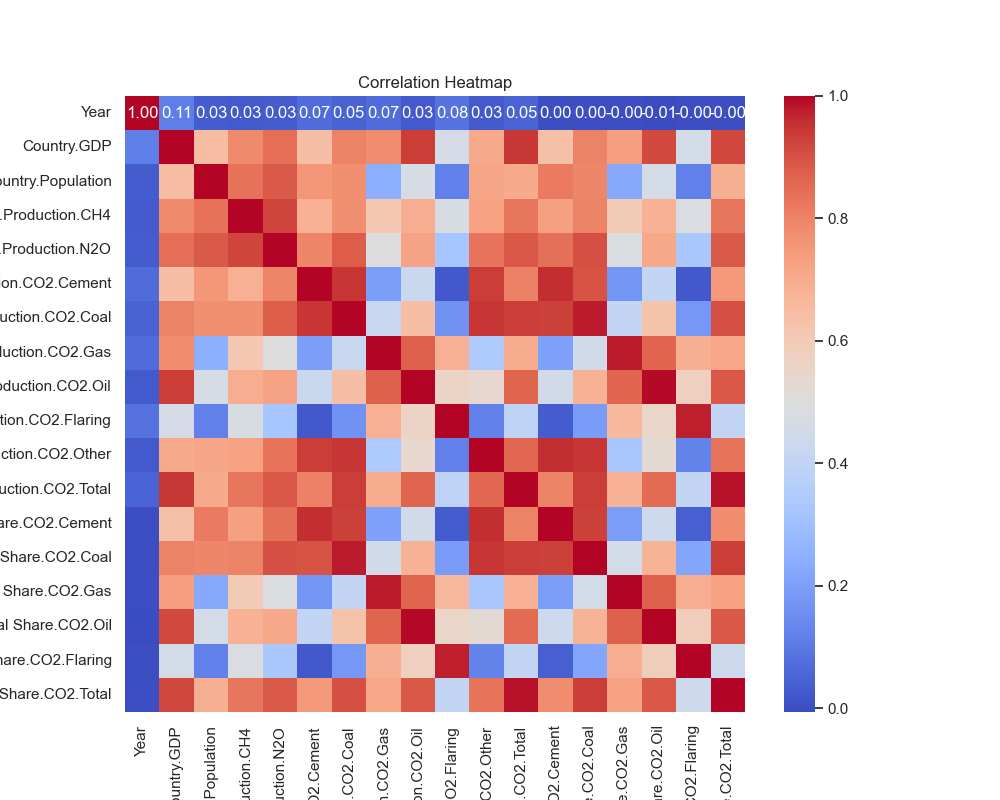

# From Correlation-Matrix 

- Expected:  
    - Very High correlation (0.94) between Production.CO2.Total and Country.Population
    - Very High correlation (0.94) between Production.CO2.Oil and Country.Population
    - Very High correlation (0.91) between Global Share.CO2.Oil and Country.Population
    - Very High correlation (0.92) between Global Share.CO2.Total and Country.Population
- Unexpected
    - Not very High correlation between all-other sources of CO2 and Country.Population

# From CO2 per capita emissions

- The per capita CO2 emissions have been greater for the middle-eastern crude producing countries. 

Reason unknown to be find? 